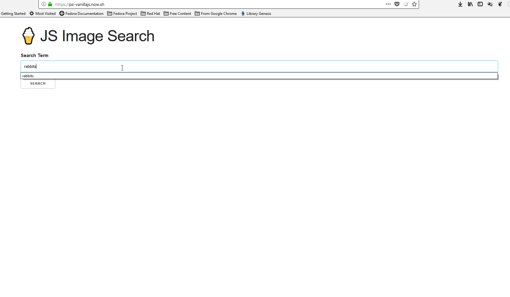

# Build an Image Search App:

#### Links for Accounts, Installations and References:


##### ACCOUNTS AND INSTALLATIONS

*Please make sure you have these accounts created and verified, plus all the installations.*

* **Create an account on github:**
  > [Create GitHub Account](https://www.github.com)
  * **And FORK this repo:**
    > [vanilla](https://github.com/patricksile/vanilla)
    > * **Install GIT:**
    [GIT download](https://git-scm.com/downloads)

* **We will be using the unsplash API , create a developper account:**
  > [Create unsplash for developers account](https://unsplash.com/developers)
<https://zeit.co/now>

* **Install lite-server:**
  * **For more details**
  > [lite-server npm](https://www.npmjs.com/package/lite-server)
  
   ```bash
    npm install -g lite-server
   ```

* **Create an account a NOW account:**
  > [Create NOW Account](https://zeit.co/now)
  * **Install NOW CLI tool:**
    > [NOW DESKTOP and CLI for W10 users:](https://zeit.co/download)
    **command for the terminal with NPM (Windows and UNIX users)**
   ```bash
    npm install -g now
   ```

* **Install the appropriate NodeJs (32 or 64bit):**
  > [Download NodeJS]()
* **Install the appropriate Ubuntu 18.04 LTS from Microsoft Store for Microsoft Windows users:**
  > [Download](https://www.microsoft.com/en-us/p/ubuntu-1804-lts/9n9tngvndl3q#activetab=pivot:overviewtab)

##### REFERENCES:

*I will recommend you spent 5 mins on these concepts don't sweat it too, it is just for your awareness now.*

* **This is a simple css framework we will be using called Skeleton:**

  > [For reference Skeleton CSS Framework](http://getskeleton.com/)

* **We will be using some concepts (Promises etc...) and some JavaScrript you might not know yet (fetch(), then()) so check this out**

  > [Reference on Promises in JS](https://developer.mozilla.org/en-US/docs/Web/JavaScript/Guide/Using_promises)
  >[Reference of the then() in JS](https://developer.mozilla.org/en-US/docs/Web/JavaScript/Reference/Global_Objects/Promise/then)
  > [Reference of the fetch() in JS](https://developer.mozilla.org/en-US/docs/Web/API/Fetch_API/Using_Fetch)


#### Link to the finished app:
[Image Search APP (VANILLAJS)](https://ps-vanillajs.now.sh)
***
##### Visual Idea of the App:



***
## Vanilla JS


the application will contact the unsplash Image Search API.

> Image search API like [Unsplash](https://unsplash.com/developers)

`https://api.unsplash.com/search/photos/`

> You will need an access key from unsplash.com. After signing up as a developper, create an application here:[unsplash application link](https://unsplash.com/oauth/applications)

All apps will use the skeleton CSS framework *You can use the CDN link down here or just keep a minified version offline*:

```html
<link rel="stylesheet" href="https://cdnjs.cloudflare.com/ajax/libs/skeleton/2.0.4/skeleton.min.css">
```

Use this style for the body:

```css 
body {
  width: 80%;
  margin: 2em auto 0 auto;
}
```

#### This app demonstrates:

* User Input
* DOM Events
* API Requests
* Conditional Rendering
* Rendering Lists of Data

#### Vanilla JS Checklist
---

* [ ] Add search form to page
* [ ] Make API Request with search term when form is submitted
* [ ] Show loading image
* [ ] Append Results to the page
* [ ] Hide loading image


### VueJS

#### Things you will have to lookup in the VueJS documentation:

> **In VueJS guide Read on this topics:**
> 
> Introduction to VueJS [Introduction — Vue.js](https://vuejs.org/v2/guide/index.html)
> * Form Input Bindings [Form Input Bindings — Vue.js](https://vuejs.org/v2/guide/forms.html)
> * Directives(v-model, @submit or v-on:submit, v-if, v-for, v-bind, v-bind:key or :key, v-bind:src or :src) [Template Syntax — Vue.js](https://vuejs.org/v2/guide/syntax.html#Directives)
> * Template Syntax(interpolations) [Template Syntax — Vue.js](https://vuejs.org/v2/guide/syntax.html#Interpolations)
> 

> [VueJS Documentation](https://vuejs.org/v2/guide/)


#### VueJS Checklist
* [ ] Install VueJS
  ```bash
  npm i -g @vue/cli
  ```
  * [ ] Install Vue boilerplate
  ```bash
  vue create <vue project name>
  ```
* [ ] Serve the Vue Project
  ```bash
  yarn serve
  ```
* [ ] Remove un-needed things delete /components/HelloWorld.vue and clean up (App.vue)
  * [ ] Install the VSCode extension "Vetur"
* [ ] Add Skeleton CDN link in /public/index.html
 ```html
    <link rel="stylesheet" href="https://cdnjs.cloudflare.com/ajax/libs/skeleton/2.0.4/skeleton.min.css">

```

* [ ] Add search form to page.
* [ ] Update state when iput changes
* [ ] Make API Request with search term when form is submitted
* [ ] Show loading image
* [ ] Append Results to the page
* [ ] Hidde loading image


